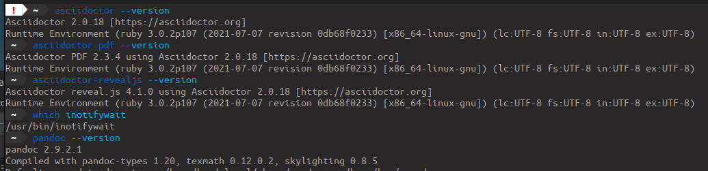

= Asciidoc(tor) Workshop
:revealjs_customtheme: theme/presentation.css
:revealjs_parallaxBackgroundImage: media/3rdparty/pexels-scott-webb-2117938.jpg
:revealjs_parallaxBackgroundSize: 8192px 4863px
:revealjs_history: true
:revealjs_fragmentInURL: true
:source-highlighter: highlight.js
:highlightjs-languages: yaml, asciidoc
:icons: font
:experimental:

A swift workshop introduction into creating beautifil Asciidoc-based PDFs, HTML and RevealJS presentations

// For development purposes: This will load a script which automatically reloads the presentation on changes
[pass]
++++

++++

[%notitle,background-iframe="https://player.vimeo.com/video/443396800?autoplay=true&background=true"]
== Welcome

[.columns]
=== About Me

[.column.is-one-quarter]
--
image:https://avatars.githubusercontent.com/u/588260[@bentolor avatar,margin=20px]
--

[.column]
--
* Benjamin Schmid, @bentolor
* 25+ years in the software industry
** Roles: CTO, Division Head, Manager Research & Innovation, Solution Architect, …
** Regular author & speaker
* Big fan of lightweight markup formats for documentation: 
  „_Focus on the content vs. coping with the formatting_“
--

=== Workshop Goals

[%step]
1. Understanding the basics of _AsciiDoc, Asciidoctor & RevealJS_
2. Learn, understand and use the most basic _tools_
3. Get a _hands-on_ experience writing AsciiDoc documents
4. Create a _HTML_ and _PDF_ version of a document
5. Apply _advanced AsciiDoc features_ 
6. Create a _simple_ RevealJS-based _presentation_
7. Understand the inner workings & interrelations
8. Understand _advanced techniques_ to _create, style & debug_ RevealJS-based _presentations_

[.columns]
=== Agenda

.Session #1 (~3h)
[.column]
--
. Introduction & Overview
. Overview: Asciidoc(tor) & Tools
. Checkpoint: Installation
. Workshop: Writing AsciiDoc documents
. _Break_
. Overview RevealJS
. Workshop: My first presentation
--

.Session #2 (2~3h)
[.column]
--
. Q&A
. Presentation design
. Advanced Asciidoc syntax
. _Break_
. Advanced topics
. Q&A & farewell
--

== Overview

[.left]
=== What is AsciiDoc & Asciidoctor?

> AsciiDoc is a _text document format_ for writing notes, documentation, articles, books, ebooks, slideshows, web pages, man pages and blogs. 

[.fragment]
--
AsciiDoc files can be translated via the _Asciidoctor_ toolchain to many formats including HTML, PDF, EPUB, DocBook, …. 
--

{nbsp}

[NOTE.fragment]
*_AsciiDoc is the language.   +
Asciidoctor is the processor._*

=== A basic AsciiDoc document

[source,asciidoc]
--
= Document title: Subtitle
Firstname Lastname <email@address.com>
Version 1.2, 2022-12-17: First revision
:stylesheet: theme/theme.css

This is the document preamble, which is optional.
By default it will render using a larger font size.

== First section
Content with *bold* content, or _italic_ or `monospaced` text.

=== A subsection
A nested section. Lists area easy

* First element
* Second element
--

=== Using Asciidoctor tools…
… AsciiDoc text documents can be rendered into various, styled formats:

[.plain]
image:media/basic-html.png[width=40%] image:media/basic-pdf.png[width=40%]

== Checkpoint: Installation

=== Assert CLI tool availability

[.xsmall]
=== Assert Visual Studio Code installation

[.plain]
image:media/vscode-check.png[List of installed Visual Studio Code plugins,width=80%]

Launch "Visual Studio Code". Open the left toolbar click on "Extensions" (also: kbd:[Ctrl+Shift+X]).  +
Assert you find at least the four installed extensions

=== Create a new document
Press kbd:[Ctrl+N] and save the file via kbd:[Ctrl+S] as `playground.adoc`.

Alternatively you can use menu:File[New Textfile] and menu:File[Save]

[.plain]
image:media/vscode-check2.png[List of installed Visual Studio Code plugins,width=80%]

[IMPORTANT]
Assert you see "AsciiDoc in the right-lower corner of the window!"

=== Open the Preview

. Press kbd:[Ctrl+Shift+P]
. Type `preview`
. Select _AsciiDoc: Open Preview to the Side_

[.plain]
image:media/vscode-check3.png[List of installed Visual Studio Code plugins,width=80%]

=== Type your first document

Now just type the text below into the editor on the left.  +
You should see the preview like on the right.

[.plain]
image:media/vscode-check4.png[List of installed Visual Studio Code plugins,width=80%]

[source,asciidoc]
--
= My first AsciiDoc

Hello world! This is my _first_ document.
--

== Interactive Demo #1

== Recap: Demo #1

=== Structuring

[source,asciidoc]
--
= Document Title
== Section 1
=== Section 1.1
A paragraph is a sequence of text. 
Even if written on separate lines

To start a new paragraph, insert an empty line.

.This is a paragraph title
A new paragraph

== Section 2
--

=== Text Formatting

[source,asciidoc]
--
* a *lightweight markup standard*.
* similarly simple as Markdown, +
  but _much_ more comprehensive & powerful
* and #markup# or [small]#custom styles# allowed
--

* a *lightweight markup standard*.
* similarly simple as Markdown, +
  but _much_ more comprehensive & powerful
* and #markup# or [small]#custom styles# allowed

[.columns]
== Lists

[column.is-one-third]
--
[source,asciidoc]
----
* List item
** Nested list item
*** Deeper nested list item
* List item
 ** Another nested list item
* List item

.List Title
. Step 1
. Step 2
.. Step 2a
.. Step 2b
. Step 3
----
--

[column]
--
[source,asciidoc]
----
.Checklist
* [*] checked
* [x] also checked
* [ ] not checked
* normal list item

.Definition List
[horizontal]
First term:: The description can start on 
the same line as the term.

Second term::
Description of the second term.
The description can also start on its own line.
----
--

== Images & Videos

[source,asciidoc]
----
image::../media/3rdparty/template.jpg[]

.A image title
image::../media/3rdparty/template.jpg[A image label, width=20%]

With only one `:` an 
image:https://asciidoctor.org/images/octocat.jpg[Mascot, role=left] 
becomes an inline image. + 
It is part of the paragraph

.Videos
video::153425222[vimeo]

or with URL / relative file path:

video::https://sample-videos.com/…/big_buck_bunny_360p_10mb.mp4[Big Bunny]
----

== Interactive Demo #2

== Recap: Demo #2

=== Tables → Source

[source,asciidoc]
--
[cols=">1h,4"]
|===
| tables | with explanations

| structured presentation | often important for specifications
| Features | like weight, alignment, ...
2+| or connected cells

| Multiline
| Style of writing
|===
--

=== Tables → Result

[cols=">1h,4"]
|===
| tables | with explanations

| structured presentation | often important for specifications
| Features | like weight, alignment, ...
2+| or connected cells

| Multiline
| Style of writing
|===

[.left]
=== Advanced elements like

Definition lists:: ... e.g. for glossaries.

Or icon:tags[] font icons which can be included icon:rocket[].

[NOTE]
Or Admonitions sections such as NOTE, TIP, IMPORTANT, CAUTION, WARNING. 

They can easily be applied like this:
[source,asciidoc]
--
[NOTE]
Or Admonitions sections such as NOTE, TIP, IMPORTANT, CAUTION, WARNING. 
--

[%notitle,background-iframe="https://docs.asciidoctor.org/asciidoc/latest/syntax-quick-reference/"]
=== Syntax Quick Reference

== Creating Outpu

[.left]
=== Document rendering

.Using tools 
* HTML:  `asciidoctor talk.adoc` 
* PDF: `asciidoctor-pdf talk.adoc`
* Presentations: `asciidoctor-revealjs presentation.adoc`
* Word DOCX: `asciidoctor -b docbook5 document.adoc -o - | pandoc -f docbook -t docx -o document.docx`

It can also produce formats like Docbook, LaTeX, EPUB, ...

{nbsp}

.Using viewers
* Editor plugins, i.e. Visual Studio Code, IntellIJ, …
* Browser plugins

== Tipps on using Visual Studio Code as editor

=== Live Preview

=== Code Snippets

Press `[Ctrl]`+`[Space]` and to look up code snippets:

You can also just type the snippet (i.e. `table` and press `[Tab]` to insert them quickly.

== Presentation

=== Debugging issues

Use the Browser Tool

=== Global scroller background

1. Find and download free very large image as background 
2. Edit it to reduce the contrast for better legibility
3. Note down its dimensions and declare it using Asciidoc attributes:
+
[source,asciidoc]
--
:revealjs_parallaxBackgroundImage: media/pexels-scott-webb-2117938.jpg
:revealjs_parallaxBackgroundSize: 8192px 4863px
--

== Practical Styling Tips

=== Spacing

[source,asciidoc]
----
You can force empty lines by…

{nbsp}

between elements. {nbsp} is an invisible, non-empty whitespace character.
----

[.tgap]
…or apply the custom `.tgap` / `.bgap` style.  +
Works on images, tables, paragraphs, etc.

[source,asciidoc]
--
[.tgap]
…or apply the custom `.tgap` / `.bgap` style.  +
Works on images, tables, paragraphs, etc.
--

=== Assigning CSS styles

.At blocks
xxx

.At slides
xx

.At images
xxx

[.xsmall]
=== Some of my template CSS classes
[cols="1m,3"]
|===
|CSS class  |effect

|.plain     | Image: Render  without decorations
|.left      | Slide: Left-align all text
|.stretch   | Slide: Use all available space
|===

== Important Resources

[.left.small]
=== Documentation Resources

https://docs.asciidoctor.org/asciidoc/latest/::
  Your **most important** documentation resource on Asciidoc usage. 
https://docs.asciidoctor.org/reveal.js-converter/latest/::
  The Asciidoctor backend plugin: This is the tool converting Asciidoc syntax to RevealJS syntax. Your 2nd most important documentation source to understand how you can do things in a `asciidoctor-revealjs` presentation.
https://revealjs.com/::
  The RevealJS HTML presentation framework. The backend for creating the nice HTML presentations.  
https://github.com/bentolor/asciidoctor-template::
  The template used in this workshop.

[.left]
== Media Resources

https://www.pexels.com/videos/::
  Find free, liberally licensed short videos and pictures, ideally as background videos during section breaks.

https://www.freeimages.com/::
  Tons of great inspiration and mood pictures with a very liberal license.

