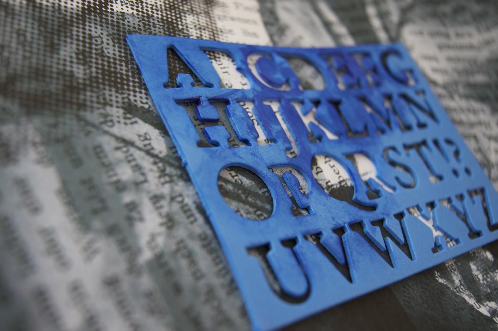

= Write compelling documents with Asciidoctor
Benjamin Schmid <my@email.com>

A live-session tale.

== Section 1
=== Section 1.1
A paragraph is a sequence of text. 
Even if written on separate lines

To start a new paragraph, insert an empty line. +
To insert a line break, end a line with `+`

.This is a paragraph title
A new paragraph.

== Section 2

== Text Formatting
This *bold*, this is _italic_, this `monospaced`.

You can #mark content to be WIP#. 

You can also [.small]#assign (custom) CSS styles# to elements. +
There are builtins like [.red]#red#, [.big]#big#, [.underline]#underline# or [.blue-background]#blue-background# . 

== Lists

* List item
** Nested list item
*** Deeper nested list item
* List item
 ** Another nested list item
* List item

or

.List Title
. Step 1
. Step 2
.. Step 2a
.. Step 2b
. Step 3

or

.Checklist
* [*] checked
* [x] also checked
* [ ] not checked
* normal list item

.Definition List

[horizontal]
First term:: The description can start on the same line
as the term.

Second term::
Description of the second term.
The description can also start on its own line.

== Images & video

.A image title

With only one `:` an image:https://asciidoctor.org/images/octocat.jpg[GitHub mascot, role=left] becomes an inline image. + 
It is part of the paragraph

.Videos
video::153425222[vimeo]

or with URL / relative file path:

video::https://sample-videos.com/video123/mp4/360/big_buck_bunny_360p_10mb.mp4[Big Bunny]

